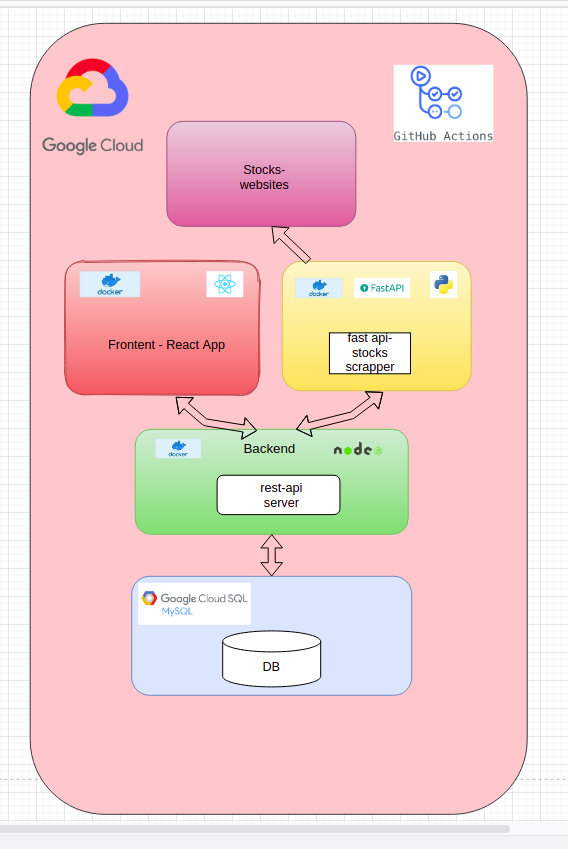

# InvestMe 

Open source app for Israeli investors- track the bests stocks in the Israeli market!   

# Features

  
  
  

  
  
  
  
# Technolegies

- CI/CD, github actions, docker, gcloud.
- React- client application.
- Node.js express- rest-api.
- Sequelize ORM ,mySql DB.
- Python Fast-api- rest-api.
- Python beautifullsoup, requests- web-scrapping.
- jest- testing the app.

### App architecture



### Development

Want to contribute? Great!

Open 3 tabs of your favorite Terminal and run these commands.

First Tab:
```sh
$ cd client && npm i && npm start
```

Second Tab:
```sh
$ cd scrapper && pip install requirements.txt && cd app && python main.py
```

Third Tab:
```sh
$ cd server && npm i && npm run dev
```

### Todos

 - Write MORE Tests
 - Add Night Mode
 - Add stock data in stock page
 - Add compairment 

